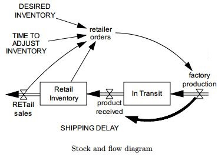

# suree-retail-stock

# The goal of this API is to implement this flow as follows

# How to run the API

In the root of the project, run

``clj -m backend.core`` to run the core.clj namespace

``clj -A:test`` to run unit tests

Requirement: it's necessary to have clojure installed on your machine
